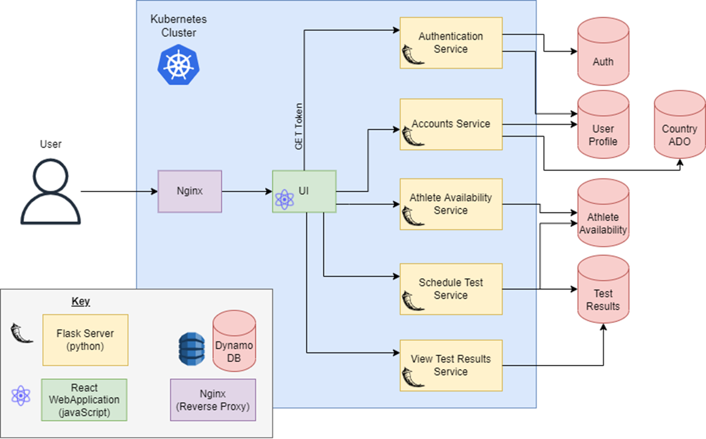

# Athlete Doping Testing - A Distributed System

This project was completed as part of the Distributed Systems module at Trinity College Dublin.
The distributed service allows athletes to specify a time and place every day where they are available to be tested.
Testers can then be assigned to these athletes to carry out the doping tests.
Below is a diagram of the system architecture.

## Requirements
- DynamoDB Tables
- Kubernetes Cluster

## Microservices
A more detailed breakdown with READMEs for each service can be found at:

- FrontEnd/

    - ui/

- Backend/Services/
    - account-service/
    - athlete-availability-service/
    - auth-service/
    - schedule-athlete-test-service/
    - view-test-results-service/